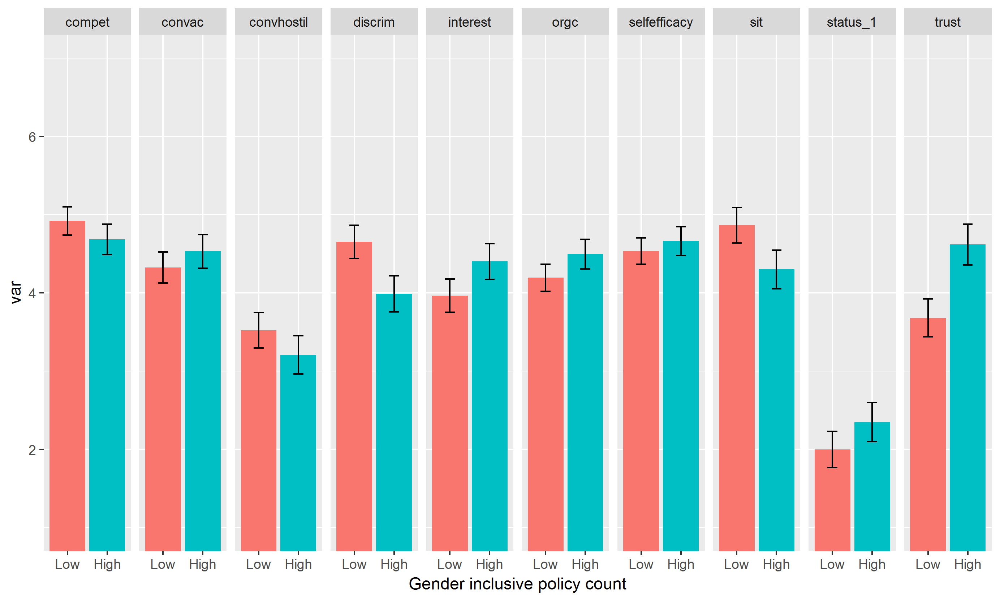

```{r setup, include=FALSE}
knitr::opts_chunk$set(echo = TRUE)
knitr::opts_knit$set(root.dir = normalizePath("../..")) 

```


```{r cars, include = FALSE}
library(tidyverse)
var_data <- read_csv("output/table_of_var_names.csv")
manip_model_data <- read_rds("output/manip_modoel_data.rds")
main_analyses_data <- read_rds("output/main_analyses_output.rds")
conv_analyses_data <- read_rds("output/conv_output.rds")
mediation_analyses_data <- read_rds("output/mediation_output.rds")
source("R/pvaluer.r")

f_lm_markdown <- . %>% 
  mutate_at(vars(p.value), format_pval) %>% 
  mutate_if(is.numeric, round, digits =2) %>% 
  knitr::kable(format = "markdown")

```


## Study overview

* Female participants were assigned to one of two conditions: 
    * View a company with a low number of gender inclusive policies.
    * View a company with a high number of gender inclusive policies.
  
* Sample size: 202 (109 = low inclusive policy count; 93 = high inclusive policy count).

## Dependent variables

We measured the following DVs:
  
* Interest in working at CCB
* Anticipated organizational commitment
* Anticipated self efficacy
* Anticipated feelings of acceptance in conversations
* Anticipated feelings of competence in conversations
* Anticipated feelings of hostility in conversations
* Anticipated competitiveness at CCB
* Anticipated trust at CCB
* Anticipated social identity at CCB
* Anticipated gender differences in status at CCB
* Anticipated gender based discrimination at CCB
* Manipulation check
* Stigma consciousness

Our primary interest was in social identity threat, anticipated conversations, and interest in working at CCB. All analyses were run controlling for stigma consciousness. For a complete list of the measures and items, see the table at the end of this document. 

## Manipulation checks

First I tested the effect of condition on our manipulation check items. Condition significantly influenced participant responding to the three manipulation check questions that focused on participants perceptions of gender inclusive policies at CCB. Our manipulation did not affect participants perceptions of the number of women at CCB. 


```{r, echo =F}
var_data %>% 
  filter(var_name == "manip") %>% 
  select(item, label) %>% 
  mutate(item = stringr::str_replace_all(item, "policy", "manip")) %>% 
  bind_rows(data_frame(item = "manip_frep", 
                       label = "Estimate the percentage of CCB's workforce that are female?")) %>% 
  arrange(item) %>% 
  rename(var_name = item, item = label) %>% 
  knitr::kable(fotmat = "markdown")
```

### Significance tests for condition differences on the above items

```{r, echo = FALSE}

manip_model_data %>% 
  select(var, fm_tidy) %>% 
  unnest() %>% 
  filter(term == "condhigh") %>% 
  select(-term) %>% 
  f_lm_markdown

manip_model_data$plots[[1]]
```

## Significance tests on our primary variables of interest

### Anticipated social indentity threat

This is the significance test for condition differences on anticipated social identity threat. 

```{r, echo=FALSE}
main_analyses_data %>% 
  filter(var_name == "sit") %>% 
  select(fm_tidy) %>% 
  unnest() %>% 
  filter(term == "condhigh") %>% 
  select(-term) %>% 
  f_lm_markdown


main_analyses_data %>% 
  filter(var_name == "sit") %>%
  .$plots 
```


### Anticipated conversational acceptance, competence, and hostility

Significance tests for condition differences on our anticipated conversation measures. Unlike past studies, significance tests revealed no significant condition differences. 


```{r, echo=FALSE}

var_data %>% 
  filter(stringr::str_detect(var_name, "^conv")) %>% 
  unite(var_name, var_name, item) %>% 
  select(-var_descrip) %>% 
  bind_rows(data_frame(var_name = c("convac", "convhostil"), 
            label = c("Mean of competence and acceptance items",
                      "Mean of hostility items"))) %>% 
  knitr::kable(format ="markdown")


##add a table of variable names.

conv_analyses_data %>% 
  select(var_name, fm_tidy) %>%
  unnest() %>% 
  filter(term == "condhigh") %>%
  select(-term) %>%
  f_lm_markdown() 

conv_analyses_data$plots[[1]]
  
```


### Interest in working at CCB

Significance tests for condition differences in interest at working at CCB. The DV is the mean of the three items below.

```{r, echo = F}
var_data %>% 
  filter(stringr::str_detect(var_name, "^inter")) %>% 
  unite(var_name, var_name, item) %>% 
  select(-var_descrip) %>% 
  knitr::kable(format ="markdown")

main_analyses_data %>% 
  filter(var_name == "interest") %>% 
  select(var_name, fm_tidy) %>% 
  unnest() %>% 
  filter(term == "condhigh") %>% 
  select(-term) %>%
  f_lm_markdown()

main_analyses_data %>% 
  filter(var_name == "interest") %>% 
  .$plots
```

## Significance tests on all of our DVs. 

These are the tests of condition differences on all of our DVs. All analyses were run controlling for stigma consciousness. For more details about the DVs, see the table at the end of this document.

```{r, echo = F}
var_data %>% 
  select(var_name, var_descrip) %>% 
  distinct() %>% 
  filter(!var_name %in% c("sc", "manip", "convaccept", "convcompet", "convhostil")) %>% 
  bind_rows(data_frame(var_name = c("convac", "convhostil"), 
            var_descrip = c("Anticipated conversational competence and acceptance",
                      "Anticipated conversational hostility"))) %>% 
  arrange(var_name) %>% 
  knitr::kable(format = "markdown")

main_analyses_data %>% 
  select(var_name, fm_tidy) %>% 
  unnest() %>% 
  filter(term == "condhigh") %>% 
  select(-term) %>%
  arrange(var_name) %>% 
  f_lm_markdown()

```




## Testing mediation models

### Social identity threat mediating the effect of condition on interest.

The mediation model revealed evidence of significant mediation. 


```{r, echo = F, warning=FALSE}
mediation_analyses_data %>% 
  filter(mf_name =="sit_interest") %>% 
  select(fm_tidy) %>% unnest() %>% 
  filter(stringr::str_detect("a|b|c|ab", label)) %>% 
  map_if(is.numeric, round, 2) %>% 
  map_at("pvalue", format_pval) %>% 
  as_data_frame() %>% 
  select(label, est, se, z, pvalue) %>% 
  knitr::kable(format ="markdown")
```

### Trust mediating the effect of condition on social identity threat.

The mediation model revealed evidence of significant mediation. 


```{r, echo =F, warning=FALSE}
mediation_analyses_data %>% 
  filter(mf_name =="trust_sit") %>% 
  select(fm_tidy) %>% unnest() %>% 
  filter(stringr::str_detect("a|b|c|ab", label)) %>% 
  map_if(is.numeric, round, 2) %>% 
  map_at("pvalue", format_pval) %>% 
  as_data_frame() %>% 
  select(label, est, se, z, pvalue) %>% 
  knitr::kable(format ="markdown")
```

### Testing a path model: Condtion > Trust > Identity threat > Interest

The path model revealed evidence of a significant indirect path from condition to interest through trust and identity threat - see "ind" for the test of the indirect effect. 


```{r, echo = F, warning=FALSE}
mediation_analyses_data %>% 
  filter(mf_name =="total_path") %>% 
  select(fm_tidy) %>% unnest() %>% 
  filter(stringr::str_detect("a1|a2|a3|c|ind", label)) %>% 
  map_if(is.numeric, round, 2) %>% 
  map_at("pvalue", format_pval) %>% 
  as_data_frame() %>% 
  select(label, est, se, z, pvalue) %>% 
  knitr::kable(format ="markdown")
```


##Table of variable names


```{r, echo = F}
var_data %>% 
  distinct(.) %>% knitr::kable(format = "markdown")
```


