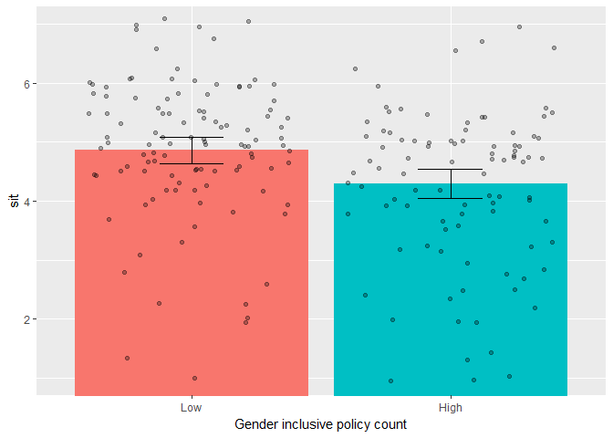
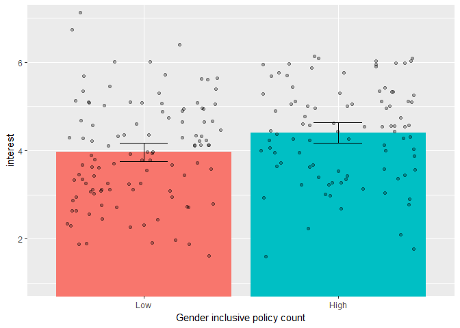

culture\_study\_hsp
================
William Hall
April 13, 2017

Study overview
--------------

-   Female participants were assigned to one of two conditions:
    -   View a company with a low number of gender inclusive policies.
    -   View a company with a high number of gender inclusive policies.
-   Sample size: 202 (109 = low inclusive policy count; 93 = high inclusive policy count).

Dependent variables
-------------------

We measured the following DVs:

-   Interest in working at CCB
-   Anticipated organizational commitment
-   Anticipated self efficacy
-   Anticipated feelings of acceptance in conversations
-   Anticipated feelings of competence in conversations
-   Anticipated feelings of hostility in conversations
-   Anticipated competitiveness at CCB
-   Anticipated trust at CCB
-   Anticipated social identity at CCB
-   Anticipated gender differences in status at CCB
-   Anticipated gender based discrimination at CCB
-   Manipulation check
-   Stigma consciousness

Our primary interest was in social identity threat, anticipated conversations, and interest in working at CCB. All analyses were run controlling for stigma consciousness. For a complete list of the measures and items, see the table at the end of this document.

Manipulation checks
-------------------

First I tested the effect of condition on our manipulation check items. Condition significantly influenced participant responding to the three manipulation check questions that focused on participants perceptions of gender inclusive policies at CCB. Our manipulation did not affect participants perceptions of the number of women at CCB.

| var\_name   | item                                                                                   |
|:------------|:---------------------------------------------------------------------------------------|
| manip\_frep | Estimate the percentage of CCB's workforce that are female?                            |
| manip1      | CCB has a large number of policies/practices that would benefit male employees.        |
| manip2      | CCB has a large number of policies/practices that would benefit female employees.      |
| manip3      | CCB has a large number of policies/practices that would benefit me if I worked at CCB. |

### Significance tests for condition differences on the above items

| var            |  estimate|  std.error|  statistic| p.value   |
|:---------------|---------:|----------:|----------:|:----------|
| manip\_frep    |      0.08|       0.15|       0.57| .571      |
| manip\_policy1 |     -0.73|       0.16|      -4.59| &lt; .001 |
| manip\_policy2 |      0.59|       0.17|       3.49| &lt; .001 |
| manip\_policy3 |      0.69|       0.17|       4.16| &lt; .001 |

Significance tests on our primary variables of interest
-------------------------------------------------------

### Anticipated social indentity threat

This is the significance test for condition differences on anticipated social identity threat.

|  estimate|  std.error|  statistic| p.value |
|---------:|----------:|----------:|:--------|
|     -0.57|       0.17|      -3.32| .001    |

    ## [[1]]

### Anticipated conversational acceptance, competence, and hostility

Significance tests for condition differences on our anticipated conversation measures. Unlike past studies, significance tests revealed no significant condition differences.

| var\_name     | label                                      |
|:--------------|:-------------------------------------------|
| convaccept\_1 | A sense of acceptance from your colleagues |
| convcompet\_1 | A sense of competence in your abilities    |
| convhostil\_1 | A sense of hostility from your colleagues  |
| convhostil\_2 | A sense of conflict from your colleagues   |
| convac        | Mean of competence and acceptance items    |
| convhostil    | Mean of hostility items                    |

| var\_name     |  estimate|  std.error|  statistic| p.value |
|:--------------|---------:|----------:|----------:|:--------|
| convac        |      0.21|       0.15|       1.38| .168    |
| convhostil    |     -0.31|       0.17|      -1.85| .066    |
| convaccept\_1 |      0.24|       0.17|       1.44| .151    |
| convcompet\_1 |      0.17|       0.17|       1.01| .314    |
| convhostil\_1 |     -0.31|       0.19|      -1.67| .096    |
| convhostil\_2 |     -0.32|       0.18|      -1.75| .081    |

### Interest in working at CCB

Significance tests for condition differences in interest at working at CCB. The DV is the mean of the three items below.

<table>
<colgroup>
<col width="14%" />
<col width="85%" />
</colgroup>
<thead>
<tr class="header">
<th align="left">var_name</th>
<th align="left">label</th>
</tr>
</thead>
<tbody>
<tr class="odd">
<td align="left">interest_1</td>
<td align="left">I would like to work at a place like CCB.</td>
</tr>
<tr class="even">
<td align="left">interest_2</td>
<td align="left">I would like to work in a company that has similar demographics to CCB.</td>
</tr>
<tr class="odd">
<td align="left">interest_3</td>
<td align="left">I would like to work in a company that has a similar culture to CCB.</td>
</tr>
</tbody>
</table>

| var\_name |  estimate|  std.error|  statistic| p.value |
|:----------|---------:|----------:|----------:|:--------|
| interest  |      0.44|       0.16|       2.75| .007    |

    ## [[1]]

Significance tests on all of our DVs.
-------------------------------------

These are the tests of condition differences on all of our DVs. All analyses were run controlling for stigma consciousness. For more details about the DVs, see the table at the end of this document.

| var\_name    | var\_descrip                                         |
|:-------------|:-----------------------------------------------------|
| compet       | Anticipated competitiveness at CCB                   |
| convac       | Anticipated conversational competence and acceptance |
| convhostil   | Anticipated conversational hostility                 |
| discrim      | Anticipated gender based discriminationat CCB        |
| interest     | Interest in working at CCB                           |
| orgc         | Anticipated organizational commitment                |
| selfefficacy | Anticipated self efficacy                            |
| sit          | Anticipated social identity at CCB                   |
| status       | Anticipated gender differences in status at CCB      |
| trust        | Anticipated trust at CCB                             |

| var\_name    |  estimate|  std.error|  statistic| p.value   |
|:-------------|---------:|----------:|----------:|:----------|
| compet       |     -0.24|       0.14|      -1.75| .081      |
| convac       |      0.21|       0.15|       1.38| .168      |
| convhostil   |     -0.31|       0.17|      -1.85| .066      |
| discrim      |     -0.66|       0.16|      -4.13| &lt; .001 |
| interest     |      0.44|       0.16|       2.75| .007      |
| orgc         |      0.30|       0.13|       2.30| .023      |
| selfefficacy |      0.13|       0.13|       0.99| .321      |
| sit          |     -0.57|       0.17|      -3.32| .001      |
| status\_1    |      0.35|       0.17|       2.02| .045      |
| trust        |      0.94|       0.18|       5.19| &lt; .001 |

Testing mediation models
------------------------

### Social identity threat mediating the effect of condition on interest.

The mediation model revealed evidence of significant mediation.

| label |    est|    se|      z| pvalue    |
|:------|------:|-----:|------:|:----------|
| c     |   0.23|  0.15|   1.55| .120      |
| a     |  -0.66|  0.17|  -3.81| &lt; .001 |
| b     |  -0.35|  0.06|  -6.05| &lt; .001 |
| ab    |   0.23|  0.07|   3.23| &lt; .001 |

### Trust mediating the effect of condition on social identity threat.

The mediation model revealed evidence of significant mediation.

| label |    est|    se|      z| pvalue    |
|:------|------:|-----:|------:|:----------|
| c     |  -0.18|  0.16|  -1.10| .270      |
| a     |   1.03|  0.18|   5.62| &lt; .001 |
| b     |  -0.47|  0.06|  -8.08| &lt; .001 |
| ab    |  -0.48|  0.10|  -4.62| &lt; .001 |

### Testing a path model: Condtion &gt; Trust &gt; Identity threat &gt; Interest

The path model revealed evidence of a significant indirect path from condition to interest through trust and identity threat - see "ind" for the test of the indirect effect.

| label |    est|    se|      z| pvalue    |
|:------|------:|-----:|------:|:----------|
| c     |   0.23|  0.15|   1.57| .120      |
| a1    |   1.03|  0.18|   5.62| &lt; .001 |
| a2    |  -0.49|  0.05|  -9.10| &lt; .001 |
| a3    |  -0.35|  0.06|  -6.14| &lt; .001 |
| ind   |   0.18|  0.05|   3.77| &lt; .001 |

Table of variable names
-----------------------

<table style="width:100%;">
<colgroup>
<col width="6%" />
<col width="25%" />
<col width="4%" />
<col width="63%" />
</colgroup>
<thead>
<tr class="header">
<th align="left">var_name</th>
<th align="left">var_descrip</th>
<th align="left">item</th>
<th align="left">label</th>
</tr>
</thead>
<tbody>
<tr class="odd">
<td align="left">interest</td>
<td align="left">Interest in working at CCB</td>
<td align="left">1</td>
<td align="left">I would like to work at a place like CCB.</td>
</tr>
<tr class="even">
<td align="left">interest</td>
<td align="left">Interest in working at CCB</td>
<td align="left">2</td>
<td align="left">I would like to work in a company that has similar demographics to CCB.</td>
</tr>
<tr class="odd">
<td align="left">interest</td>
<td align="left">Interest in working at CCB</td>
<td align="left">3</td>
<td align="left">I would like to work in a company that has a similar culture to CCB.</td>
</tr>
<tr class="even">
<td align="left">orgc</td>
<td align="left">Anticipated organizational commitment</td>
<td align="left">1</td>
<td align="left">If I worked at CCB, I would be proud to tell people that I worked there.</td>
</tr>
<tr class="odd">
<td align="left">orgc</td>
<td align="left">Anticipated organizational commitment</td>
<td align="left">2</td>
<td align="left">If I worked at CCB, I would be committed to staying.</td>
</tr>
<tr class="even">
<td align="left">orgc</td>
<td align="left">Anticipated organizational commitment</td>
<td align="left">3</td>
<td align="left">IfI worked at CCB, I would feel myself to be a part of theorganization.</td>
</tr>
<tr class="odd">
<td align="left">orgc</td>
<td align="left">Anticipated organizational commitment</td>
<td align="left">4</td>
<td align="left">If I worked at CCB, I would be trying to find another job quickly.</td>
</tr>
<tr class="even">
<td align="left">orgc</td>
<td align="left">Anticipated organizational commitment</td>
<td align="left">5</td>
<td align="left">If I worked at CCB, I wouldn't recommend joining CCB to a close friend.</td>
</tr>
<tr class="odd">
<td align="left">orgc</td>
<td align="left">Anticipated organizational commitment</td>
<td align="left">6</td>
<td align="left">If I worked at CCB, I wouldn't work there for longer thantwo years.</td>
</tr>
<tr class="even">
<td align="left">selfefficacy</td>
<td align="left">Anticipated self efficacy</td>
<td align="left">1</td>
<td align="left">If I worked at CCB, I would be able to face difficulties that came up in my job.</td>
</tr>
<tr class="odd">
<td align="left">selfefficacy</td>
<td align="left">Anticipated self efficacy</td>
<td align="left">2</td>
<td align="left">If I worked at CCB, my time there would prepare me well for my occupational future.</td>
</tr>
<tr class="even">
<td align="left">selfefficacy</td>
<td align="left">Anticipated self efficacy</td>
<td align="left">3</td>
<td align="left">Working at CCB would allow me to meet the career goals that I set for myself in my job.</td>
</tr>
<tr class="odd">
<td align="left">selfefficacy</td>
<td align="left">Anticipated self efficacy</td>
<td align="left">4</td>
<td align="left">If I worked at CCB, I would feel prepared to meet most of the demands of the job.</td>
</tr>
<tr class="even">
<td align="left">convaccept</td>
<td align="left">Anticipated feelings of acceptance in coversations</td>
<td align="left">1</td>
<td align="left">A sense of acceptance from your colleagues</td>
</tr>
<tr class="odd">
<td align="left">convcompet</td>
<td align="left">Anticipated feelings of competence in coversations</td>
<td align="left">1</td>
<td align="left">A sense of competence in your abilities</td>
</tr>
<tr class="even">
<td align="left">convhostil</td>
<td align="left">Anticipated feelings of hostility in coversations</td>
<td align="left">1</td>
<td align="left">A sense of hostility from your colleagues</td>
</tr>
<tr class="odd">
<td align="left">convhostil</td>
<td align="left">Anticipated feelings of hostility in coversations</td>
<td align="left">2</td>
<td align="left">A sense of conflict from your colleagues</td>
</tr>
<tr class="even">
<td align="left">compet</td>
<td align="left">Anticipated competitiveness at CCB</td>
<td align="left">1</td>
<td align="left">If I worked at CCB, I think that many people would be competitive.</td>
</tr>
<tr class="odd">
<td align="left">compet</td>
<td align="left">Anticipated competitiveness at CCB</td>
<td align="left">2</td>
<td align="left">If I worked at CCB, I think that many people would often avoid being too competitive.</td>
</tr>
<tr class="even">
<td align="left">trust</td>
<td align="left">Anticipated trust at CCB</td>
<td align="left">1</td>
<td align="left">If I worked at CCB, I would be treated fairly.</td>
</tr>
<tr class="odd">
<td align="left">trust</td>
<td align="left">Anticipated trust at CCB</td>
<td align="left">2</td>
<td align="left">If I worked at CCB, I would trust them to treat me fairly.</td>
</tr>
<tr class="even">
<td align="left">sit</td>
<td align="left">Anticipated social identity at CCB</td>
<td align="left">1</td>
<td align="left">If you worked at CCB, how often do you think that people would think about your gender when judging you?</td>
</tr>
<tr class="odd">
<td align="left">sit</td>
<td align="left">Anticipated social identity at CCB</td>
<td align="left">2</td>
<td align="left">If you worked at CCB, how often would you worry that people might judge you because of what they think of your gender?</td>
</tr>
<tr class="even">
<td align="left">sit</td>
<td align="left">Anticipated social identity at CCB</td>
<td align="left">3</td>
<td align="left">If you worked at CCB, how often would you worry that people would judge your gender because of your behavior?</td>
</tr>
<tr class="odd">
<td align="left">sit</td>
<td align="left">Anticipated social identity at CCB</td>
<td align="left">4</td>
<td align="left">If you worked at CCB, howoften would you worry about other people of your gender acting inways that confirm gender stereotypes?</td>
</tr>
<tr class="even">
<td align="left">status</td>
<td align="left">Anticipated gender differences in status at CCB</td>
<td align="left">1</td>
<td align="left">At CCB, whodo you think would occupy higher status positions in the organization.</td>
</tr>
<tr class="odd">
<td align="left">discrim</td>
<td align="left">Anticipated gender based discriminationat CCB</td>
<td align="left">1</td>
<td align="left">If I worked at CCB, Ithink that because of my gender I would experience discrimination.</td>
</tr>
<tr class="even">
<td align="left">discrim</td>
<td align="left">Anticipated gender based discriminationat CCB</td>
<td align="left">2</td>
<td align="left">If I worked at CCB, Ithink that because of my gender I would experience harassment.</td>
</tr>
<tr class="odd">
<td align="left">discrim</td>
<td align="left">Anticipated gender based discriminationat CCB</td>
<td align="left">3</td>
<td align="left">If I worked at CCB, I think I would be the target of sexism.</td>
</tr>
<tr class="even">
<td align="left">discrim</td>
<td align="left">Anticipated gender based discriminationat CCB</td>
<td align="left">4</td>
<td align="left">If I worked at CCB, I think I would witness sexist behavior.</td>
</tr>
<tr class="odd">
<td align="left">manip</td>
<td align="left">Manipulation check</td>
<td align="left">policy1</td>
<td align="left">CCB has a large number of policies/practices that would benefit male employees.</td>
</tr>
<tr class="even">
<td align="left">manip</td>
<td align="left">Manipulation check</td>
<td align="left">policy2</td>
<td align="left">CCB has a large number of policies/practices that would benefit female employees.</td>
</tr>
<tr class="odd">
<td align="left">manip</td>
<td align="left">Manipulation check</td>
<td align="left">policy3</td>
<td align="left">CCB has a large number of policies/practices that would benefit me if I worked at CCB.</td>
</tr>
<tr class="even">
<td align="left">sc</td>
<td align="left">Stigma consciousness</td>
<td align="left">1</td>
<td align="left">When interacting with men, I feel like they interpret all my behaviors in terms of the fact that I am a woman</td>
</tr>
<tr class="odd">
<td align="left">sc</td>
<td align="left">Stigma consciousness</td>
<td align="left">2</td>
<td align="left">Most men do not judge women on the basis of their gender.</td>
</tr>
<tr class="even">
<td align="left">sc</td>
<td align="left">Stigma consciousness</td>
<td align="left">3</td>
<td align="left">My being female does not influence how men act with me.</td>
</tr>
<tr class="odd">
<td align="left">sc</td>
<td align="left">Stigma consciousness</td>
<td align="left">4</td>
<td align="left">Most men have a problem viewing women as equals.</td>
</tr>
</tbody>
</table>
